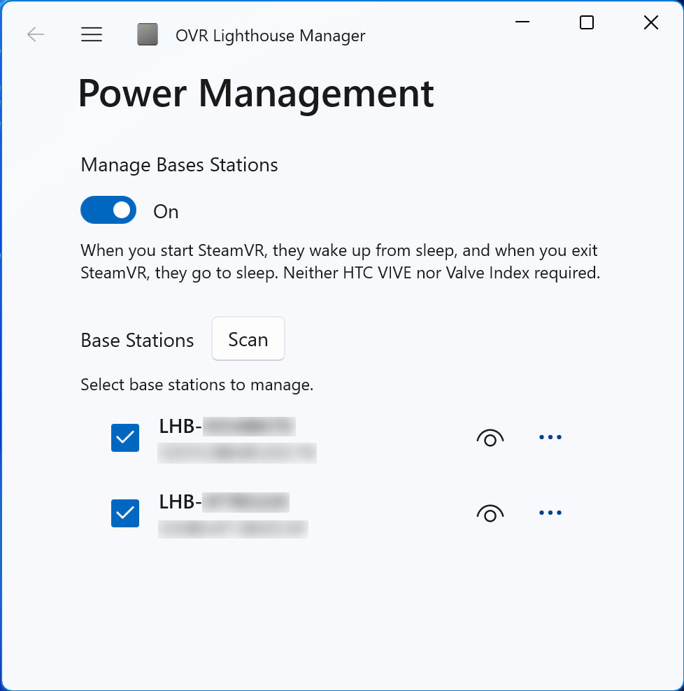

[ English | [日本語](./README_JP.md) ]

# OVR Lighthouse Manager

A tool to manage the power of SteamVR base stations.

You can control the power of the base stations without HTC Vive or Valve Index by linking it to the start and end of SteamVR.

</img>

## Features

- Power control of base stations (power on / sleep / standby)
- Power control of base stations linked to start and end of SteamVR

## Supported Environment

- Windows 11
- Windows 10 version 1809 or later
- SteamVR Base Station 2.0

## How to use

### Initial Setup

1. Start OVR Lighthouse Manager from the start menu.
2. The surrounding base stations are automatically listed.
3. Turn on **Manage Base Stations**.
4. Select base station you want to link to the start and end of SteamVR from the list.

## License

[GPLv3](./LICENSE)

## Contact

- VRCID: kurotu
- X: [@kurotu](https://twitter.com/kurotu)
- GitHub: [kurotu/OVR-Lighthouse-Manager](https://github.com/kurotu/OVR-Lighthouse-Manager)
