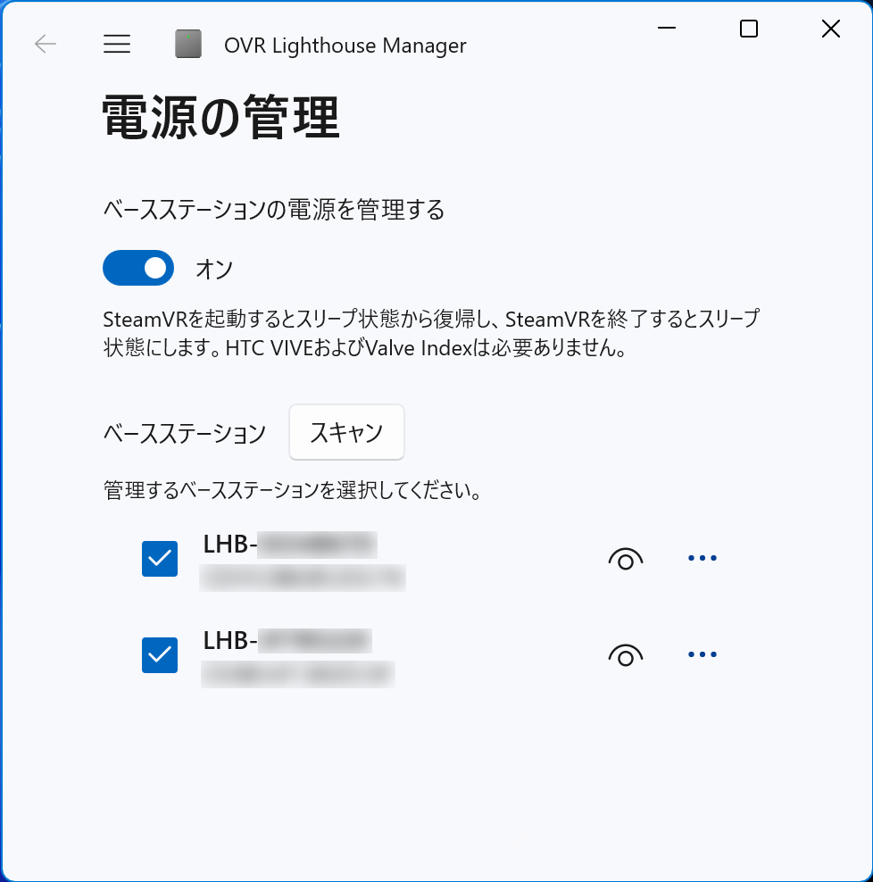

[ [English](./README.md) | 日本語 ]

# OVR Lighthouse Manager

SteamVR ベースステーションの電源を管理するためのツールです。
HTC Vive や Valve Index なしでも SteamVR の起動・終了に連動してベースステーションの電源を制御することができます。

<a href="https://kurotu.booth.pm/items/5315515">
    </img>
</a>
<a href="https://kurotu.gumroad.com/l/uaqwv">
    </img>
</a>

</img>

## 概要

SteamVR には、SteamVR の起動時にベースステーションを自動的に電源オンにし、SteamVR の終了時にベースステーションを自動的にスリープにする機能があります。しかし、この機能は HTC VIVE や Valve Index がないと動作しません。
OVR Lighthouse Manager は、Bluetooth LE を使って HTC VIVE や Valve Index なしでもベースステーションの電源を制御することができます。
スタンドアロン型のヘッドセット (Quest, PICO など) と VIVE トラッカーの組み合わせで使うとき便利です。

## 機能

- Bluetooth LE によるベースステーションの電源制御 (電源オン, スリープ, スタンバイ)
- SteamVR の起動・終了に連動したベースステーションの電源制御

## 必要環境

- Windows 11
- Windows 10 バージョン 1809 以降
- SteamVR ベースステーション 1.0 / 2.0
- Bluetooth LE

## 使い方

### 初回設定

1. スタートメニューから OVR Lighthouse Manager を起動します。
2. 周囲のベースステーションが自動的にリストアップされます。
3. 「ベースステーションの電源を管理する」をオンにします。
4. SteamVR の起動・終了に連動させたいベースステーションをリストから選びます。

> [!NOTE]
> ベースステーション 1.0 を使う場合は、背面ラベルに印刷された ID (8桁の英数字) を入力してください。

以降、SteamVR の起動・終了に連動して自動的にベースステーションの電源を制御します。
スタートアップへの登録やサービス化は不要です。

## ライセンス

[GPLv3](./LICENSE)

## 連絡先

- VRCID: kurotu
- X: [@kurotu](https://twitter.com/kurotu)
- GitHub: [kurotu/OVR-Lighthouse-Manager](https://github.com/kurotu/OVR-Lighthouse-Manager)
